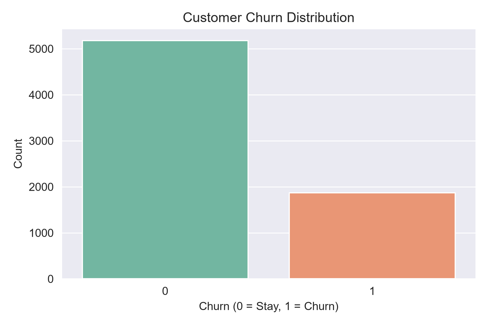
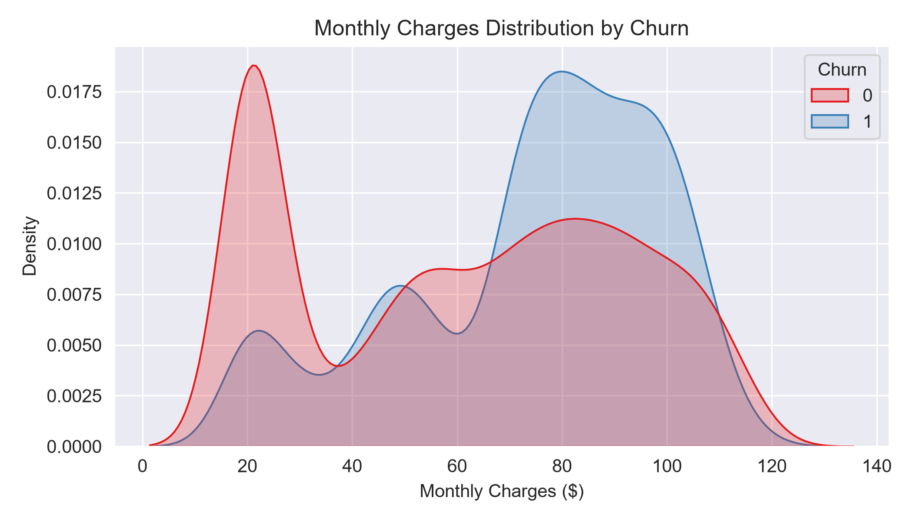
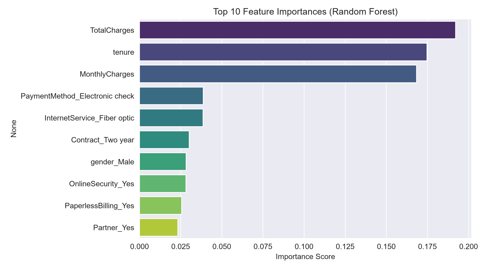

```markdown
<div align="center">

# 📊 Telco Customer Churn Prediction & Retention Analytics
### 🚀 End-to-End Machine Learning Pipeline for Customer Attrition Risk Classification


</div>

---

## 📌 1. Project Title
**Telco Customer Churn Prediction & Retention Analytics (ML-Driven)**  
*Customer Retention Analysis with Classification Modeling and Business Insights*

---

## 📖 2. Overview / Description

This project is an **end-to-end Machine Learning classification pipeline** designed to predict customer churn for a telecommunications provider. By analyzing historical customer profiles, subscribed services, account details, and billing patterns, the system accurately detects high-risk customers likely to discontinue services.

### 🎯 Key Objectives:
* 🔍 **Proactive Retention:** Enable telecom teams to identify at-risk customers before churn occurs.
* 📈 **Data-Driven Strategy:** Extract core behavioral drivers influencing customer decisions.
* ⚙️ **Automated Inference:** Provide serialized model artifacts (`.pkl`) ready for production scoring.

---

## ✨ 3. Features & Highlights

- 🧹 **Robust Data Pipeline:** Missing value imputation, automated numeric conversions, and standard encoding.
- 📊 **Exploratory Data Analysis (EDA):** In-depth visual breakdowns across tenure cohorts, contract structures, and payment methods.
- 🤖 **Model Benchmarking:** Multi-algorithm evaluation across **Logistic Regression**, **Random Forest**, and **Decision Tree** classifiers.
- 🎯 **Feature Importance Profiling:** Pinpointing exact drivers of customer attrition.
- 💾 **Model Persistence:** Production-ready serialized pipeline saved with `joblib`.
- 💡 **Strategic Business Insights:** Actionable recommendations tailored for telecom retention teams.

---

## 📁 4. Project Structure

```text
📂 Telco-Customer-Churn-Prediction/
├── 📄 README.md                                # Comprehensive Project Documentation
├── 📊 WA_Fn-UseC_-Telco-Customer-Churn.csv    # Raw IBM Telco Dataset
├── 📓 Telco_Customer_Churn.ipynb               # Full ML Workflow (EDA to Modeling)
├── 💾 churn_rf_model.pkl                       # Trained Production Model Artifact
├── 🖼️ churn_distribution.png                  # EDA Visualization - Churn Breakdown
├── 🖼️ contract_churn.png                       # EDA Visualization - Monthly Charges / Contract
├── 🖼️ feature_importance.png                  # ML Visualization - Feature Importance
└── 📑 Out_22.csv                               # Generated Predictions / Processed Output

```

---

## 🗂️ 5. Dataset Architecture

### 📍 Source & Dimensions

* **Source:** IBM Telco Customer Churn Dataset (`WA_Fn-UseC_-Telco-Customer-Churn.csv`)
* **Volume:** 7,043 Customer Records | 21 Attributes
* **Split Strategy:** 80% Training (5,634 rows) | 20% Testing (1,409 rows) stratified

### 🏷️ Input Features (X) & Target (Y)

| Category | Features |
| --- | --- |
| 👤 **Demographics** | `gender`, `SeniorCitizen`, `Partner`, `Dependents` |
| 💳 **Account & Billing** | `tenure`, `Contract`, `PaperlessBilling`, `PaymentMethod`, `MonthlyCharges`, `TotalCharges` |
| 📡 **Subscribed Services** | `PhoneService`, `MultipleLines`, `InternetService`, `OnlineSecurity`, `OnlineBackup`, `DeviceProtection`, `TechSupport`, `StreamingTV`, `StreamingMovies` |
| 🎯 **Target Variable (Y)** | **`Churn`** (`0 = No / Stay`, `1 = Yes / Churn`) |

### ⚙️ Preprocessing Workflow

1. **Cleaning:** Cast `TotalCharges` from string/object to floating-point with median replacement for blank values.
2. **Feature Pruning:** Removed non-predictive `customerID`.
3. **Encoding:** Dummy encoding (`pd.get_dummies(drop_first=True)`) applied across categorical features.
4. **Standardization:** Integrated `StandardScaler` to ensure linear algorithm convergence.

---

## 🧠 6. Model Architecture & Benchmarking

| Model Architecture | Core Configuration | Purpose |
| --- | --- | --- |
| 🔹 **Logistic Regression** | `StandardScaler` + L2 Penalty | High-interpretability probabilistic classification |
| 🌲 **Random Forest** | `n_estimators=100`, Ensemble Trees | Non-linear interaction capture & feature ranking |
| 🌳 **Decision Tree** | Standard Gini criterion | Baseline structural benchmarking |

---

## 🧪 7. Model Execution

Run the complete pipeline directly through Jupyter Notebook:

```bash
jupyter notebook Telco_Customer_Churn.ipynb

```

> **Hardware Requirement:** Standard CPU execution (No GPU acceleration required).

---

## 📊 8. Experiments, Results & Visualizations

### 🏆 Model Comparison Benchmark

| Classifier | Accuracy | Precision | Recall | F1-Score |
| --- | --- | --- | --- | --- |
| 🥇 **Logistic Regression** | **80.70%** | **0.6584** | **0.5668** | **0.6092** |
| 🥈 **Random Forest** | 78.64% | 0.6237 | 0.4920 | 0.5501 |
| 🥉 **Decision Tree** | 74.17% | 0.5139 | 0.4947 | 0.5041 |

---

### 📈 Visual Insights

---

### 🔑 Top Churn Drivers Identified

1. 📝 **Month-to-Month Contracts:** Strongest positive predictor for customer departure.
2. ⏳ **Customer Tenure:** Longer tenure drastically reduces attrition risk.
3. 💵 **Higher Monthly Charges:** Customers paying >$70/mo demonstrate elevated churn propensity.
4. 🌐 **Fiber Optic Internet:** Exhibits higher churn compared to standard DSL accounts.

---

## 🏁 9. Results & Model Summary

* 🏆 **Selected Best Model:** Logistic Regression
* 🎯 **Evaluation Accuracy:** **80.70%**
* 📐 **Balanced F1-Score:** **0.6092**
* 📦 **Serialized Artifact:** `churn_rf_model.pkl`

---

## 📝 10. Conclusion

This project successfully constructs an end-to-end classification system for telecom churn estimation. Logistic Regression delivers the best overall performance with **80.70% accuracy**, providing well-calibrated probabilities for retention campaigns.

---

## 💻 11. Installation & Local Setup

```bash
# 1. Clone the repository
git clone [https://github.com/akashvidunitha2005-apple/Telco-Customer-Churn-Prediction.git](https://github.com/akashvidunitha2005-apple/Telco-Customer-Churn-Prediction.git)
cd Telco-Customer-Churn-Prediction

# 2. Install required packages
pip install pandas numpy scikit-learn matplotlib seaborn joblib

# 3. Launch Notebook
jupyter notebook Telco_Customer_Churn.ipynb

```

---

## 🔮 12. Future Roadmap

* [ ] 🌐 Deploy an interactive Streamlit / Flask web UI for instant customer scoring.
* [ ] ⚖️ Implement SMOTE / class weighting to maximize minority class Recall.
* [ ] 🔍 Hyperparameter optimization using `GridSearchCV`.
* [ ] 🧠 Explainable AI integration using **SHAP** values for individual customer risk explanation.

---

## 🎓 13. Citation & Coursework

*Project completed as part of the Machine Learning Course at **SLIPD Academy**.*

---

## 📜 14. License

Distributed under the **MIT License**. See `LICENSE` for more information.

```
### 📈 Visual Insights & EDA

<p align="center">
  
  
</p>

<p align="center">
  
</p>
```
